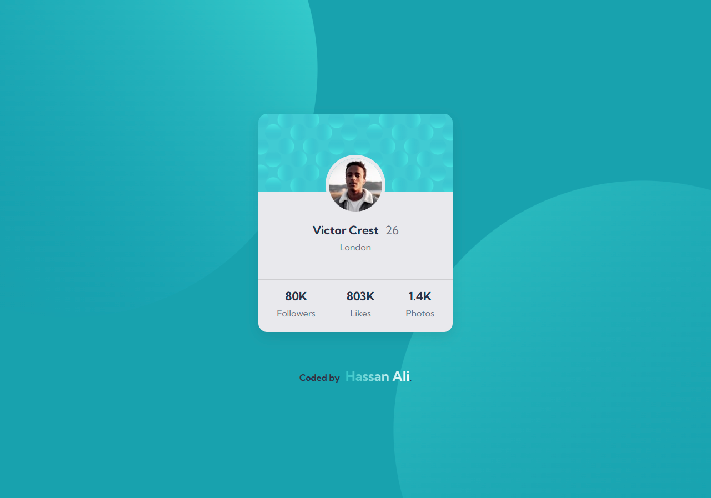
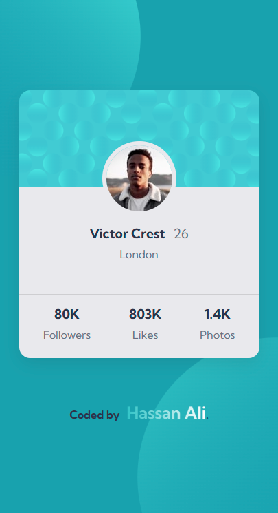

# Frontend Mentor - Profile Card Component Solution

This is my solution to the **Profile Card Component** challenge on Frontend Mentor.  
Frontend Mentor challenges help you practice building realistic, production-ready components with modern HTML and CSS.

---

## 📌 Overview

### 🔹 The Challenge

Users should be able to:

- View the profile card layout optimally depending on their device screen size
- See a visually appealing component with clean spacing and readable typography
- Experience balanced and responsive background patterns on all screens

---

## 🖼️ Screenshots

### 🖥️ Desktop  

### 📱 Mobile  

## 🌐 Live Demo

👉 **[View Live Demo](https://hassan-ali-byte.github.io/profile-card-component-main/)**  

---

## ⚙️ My Process

### **Built With**

- **Semantic HTML5** (`<main>`, `<article>`)
- **Modern CSS**
  - Custom properties (variables)
  - Flexbox for card layout
  - Grid for page centering
  - `clamp()` for fluid typography
- **Multiple background images** 
- **Mobile-first workflow**
- **Hover animations**
  - Card scaling with shadow increase
  - Gradient underline using `::after` pseudo-element

---

## 📚 What I Learned

- Learned that `max-width` on a child element can fail to work properly when using CSS Grid with `justify-content: center`.
- Understood how absolute and relative widths behave differently with `place-content` in CSS Grid.
- Solved the max-width issue by removing `justify-content: center` and using `margin: auto` to center the component horizontally.
- Learned how to handle multiple background images, including positioning and layering for responsive layouts.
- Practiced creating smooth line transitions using `scaleX` that animate left-to-right on hover and right-to-left when hover is removed.

## 🔗 Resources

- **Kevin Powell** – Responsive layouts and CSS tips
---

## 👨‍💻 Author

**Hassan Ali**

- Frontend Mentor – [@hassan-ali-byte](https://www.frontendmentor.io/profile/hassan-ali-byte)
- GitHub – [hassan-ali-byte](https://github.com/hassan-ali-byte)

---

## ✨ Thanks for checking out my solution!

Feedback and suggestions are always welcome 🙌

